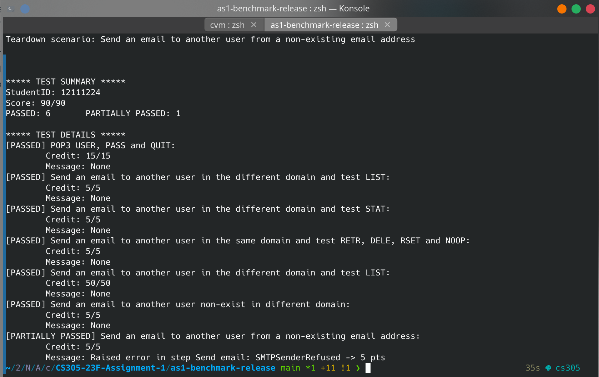
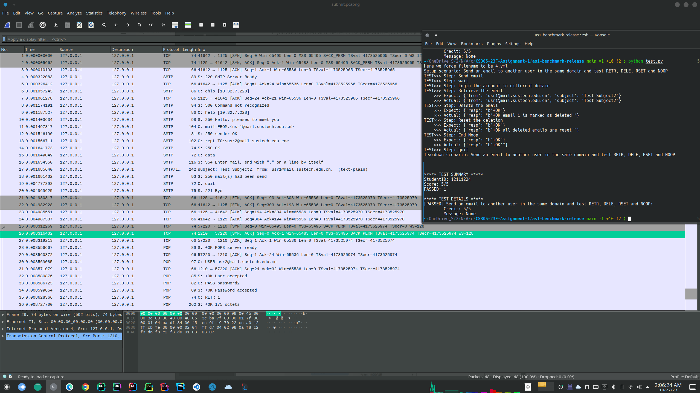
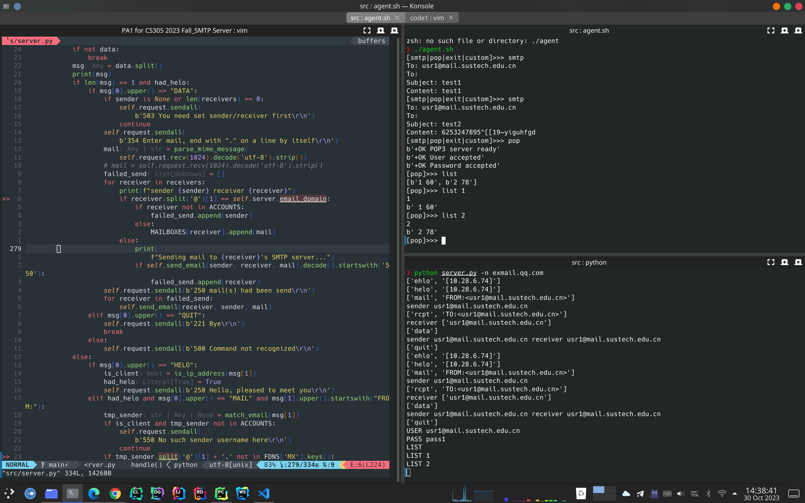
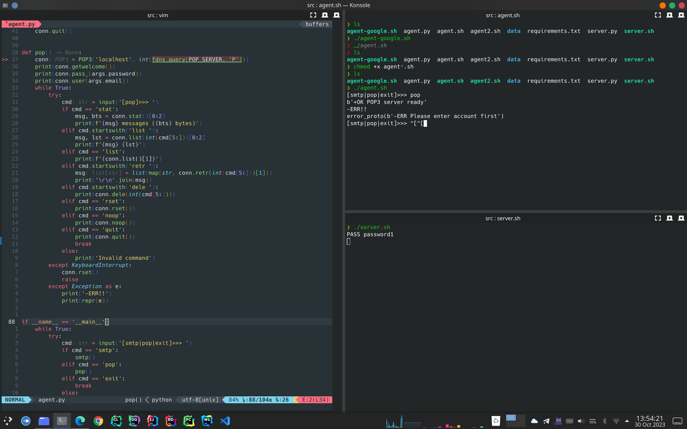
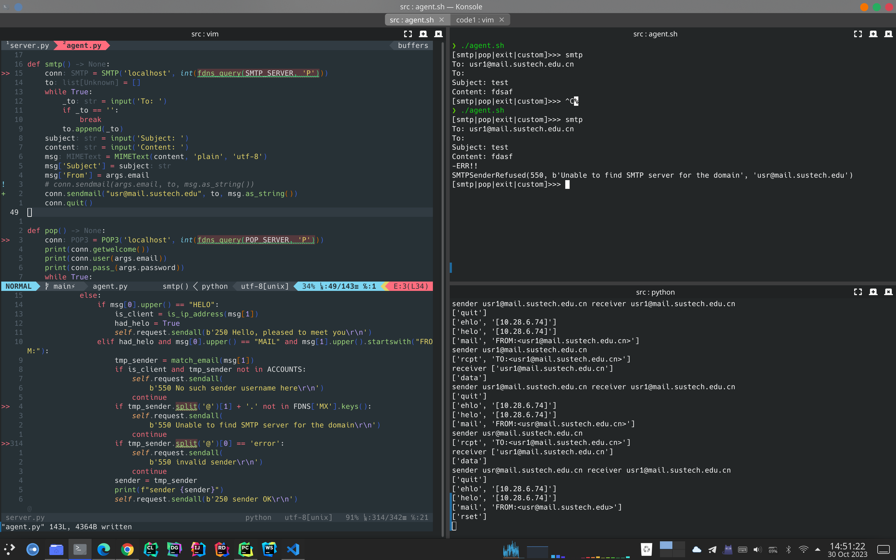
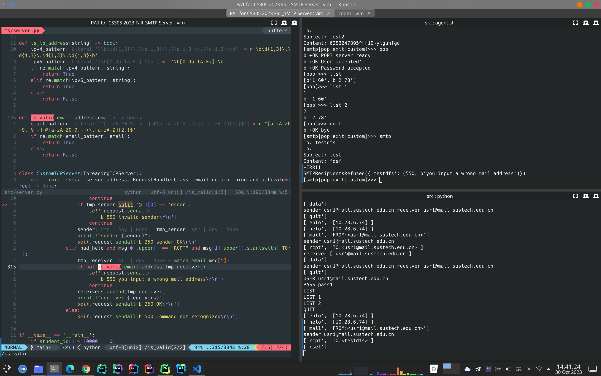
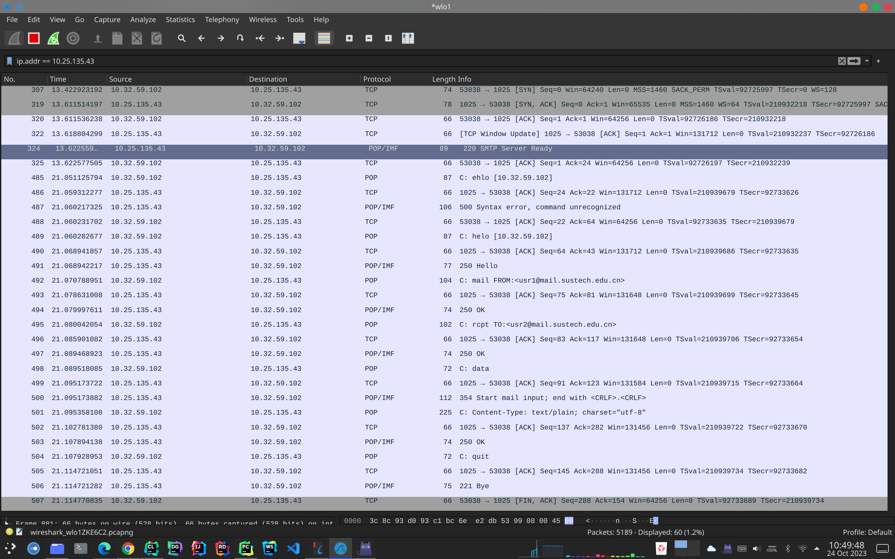
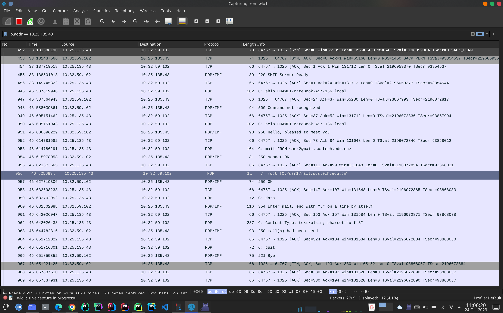

# Code Assignment 1
>
>12111224 贾禹帆

## Test script

脚本测试结果

抓包结果在该文件夹下，叫"submit.pcapng"

## Advance

### Bonus

- MIME邮件content解码:

- Pop command: list x

#### Error Handling

##### POP server

必须在输入密码前输入用户名,修改agent.py让客户端先发送password再发送username,结果如下

##### SMTP server

发件客户端用户名检查: 通过HELO后跟的字符，我们可以判断时客户端送信还是服务器送信(客户端一般是IP,服务器是域名),对于客户端我们检查sender的账户后缀是否属于于当前服务器
>我们临时修改agent.py来使用一个不属于当前邮件服务器的sender用户名

Receiver用户名检查:检查receiver地址是否合法<xxx@xx.xx>

### 互发邮件

和康耀中(12110225)互发的邮件。具体操作是先连接到同一个WiFi,然后各自`ifconfig/ip addr`查看自己无线网卡被分配的ipv4地址，用`telnet`查看对方端口是否开放(有可能端口被防火墙屏蔽)。之后启动服务器，修改`agent.py`文件，将pop和smtp的ip从‘localhost’改为对方的ip,然后执行smtp发送和pop查看邮件即可。

>发给康耀中的部分包截图

>作为服务器接受康耀中发的邮件的部分包截图

